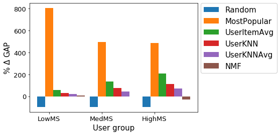

# ATTENTION: This is only a draft, the real report is on [Overleaf](https://de.overleaf.com/project/61e04c40bc88877b64d5e22d).

## Overview

The paper we have analyzed is a reproducibility study. The original paper it tries to reproduce is concerned with bias in recommender systems. More specifically it looks at recommender systems in the movie domain. The analyzed study tries to reproduce the study results in the domain of music recommendation.
The bias analyzed is concerned with popularity which means that popular items get a lot more exposure than less popular items.

## The Original Paper
- describe domain
- describe sampling strategy
- describe used recommenders

They divided all users into three groups according to user's interest in popular movies.
Their experiment results show that many recommender systems are biased towards recommending popular items even if a user is interested in non-popular items.

## The Analyzed Paper

The analyzed paper aims to reproduce the observed bias of the original paper in the domain of music recommendation.
- describe domain
- describe sampling strategy
They used the LFM-1b dataset, a dataset containing the listing history for over 120k users of the LastFM music platform. The users were divided into three groups by selecting the 1k top, 1k bottom and 1k median users ordered by their preferences to listen mainstream music.

However, the recommendation items in original paper are movies not actors or film markers or any other entity that is related to more than one item.
It is therefore debatable if music tracks would not be the more adequate choice to translate the original paper into the music domain.
- describe results (maybe include plot from original paper)

## Found Resources 
- list and describe found / used resources

## Steps Taken
- used github code of authors
- collected correct package versions
- rerun provided code --> same results
- loaded original (last fm ) dataset
- reproduced authors sampling
- rerun provided code with reproduced sampling --> not same results
- defined percentile sampling and rerun provided code with reproduced sampling

We used the Jupyter Notebooks provided by the authors on GitHub to rerun their calculations. Since they only provided a list of used package without explicit package versions, we tried to reconstruct which versions were most likely used. The original paper was submitted on the 10th of December 2019. All versions of the required libraries were chosen to correspond to the latest stable version at this date. As python 3.8.0 was the latest major python release by the time the paper was submitted (https://www.python.org/downloads/) this version was chosen.

With the jupyter notebooks, external dependencies and the preprocessed data of the author provided on [Zenodo](https://zenodo.org/record/3475975#.YeBSdVkxlPY) we were able to execute the authors code. These results were the same as stated by the authors in their paper.

The first thing we noticed is that the sampling in the analyzed paper differs from the original paper. As described, above they order the users by mainstreamness and took the top 1k user for the High Mainstreamness Group (HighMS), the bottom 1k users for the Low Mainstreamness Group (LowMS) and the median1k users for the Medium Mainstreamness Group (MedMS).
In contrast, in the original paper the 3 groups were sampled as the top 20%, bottom 20% of most popular items for HighMS and LowMS and all other items for the MedMS group. Therefore the low and the high group in the original paper contain much less extreme items than in the analyzed paper. Considering that the top 1k users with the highest mainstreamness score only reflect the ~ 0.8% most extreme mainstream listeners, while the original paper represents with 20% a wider range and diversity of mainstream items. 

We argue that this extreme sampling could influence the observed bias effect in the outcome for the low and high group and thus do not reflect the same procedure as presented in the original paper.
Due to this reason, we proposed a different sampling strategy: 
We split all 120k users of the LFM_1b dataset into 3 groups according the *mainstreaminess_global* (the 20% top, 20% bottom and the rest of all users). 1000 users were than randomly sampled from each group. With this sampling we re-executed the given data pipeline. The following figure compares the results of our adpated sampling and the sampling given in the paper:

## TODO add result plots

To our surprise a huge difference  could be spotted.
However, further investigations revealed that we were not working with the exact same data as the paper authors. The user with the highest mainstreamness score in the Last-FM dataset was not the same user as given in the papers data files. Furthermore, querying the Last-FM dataset for specific users, revealed that the authors used not the same value for mainstreamness as given in the Last-FM dataset. Which is contrary to what is stated in the paper:

    “[..] we use the mainstreaminess score, which is available for the users in the LFM-1b dataset and which is defined as the overlap between a user’s listening history and the aggregated listening history of all Last.fm users in the dataset”

Also the metadata of the provided user group files described the value column as *mainstreaminess_value*. Only in the datafile itself the column was named *M_global_R_APC*, which intensified our suspicion that a transformed or different value than the Last-FM dataset mainstreamness has been used. We contacted the authors and learned that they indeed did not used the *mainstreaminess_global* from the LFM_1b dataset but instead used the *M_global_R_APC* definition as proposed by Bauer et. al in [Global and country-specific mainstreaminess measures: Definitions, analysis, and usage for improving personalized music recommendation systems](https://journals.plos.org/plosone/article?id=10.1371/journal.pone.0217389).

### Reproducing calculation of *M_global_R_APC* 

In order to execute our adapted sampling and to reproduce the metric calculation we started to implement the *M_global_R_APC* value as defined in this paper.
This metric defined mainstreaminess of a specific user's music history by Kendall's correlation of all artists ranked by the total play counts and the artists listened by the user & ranked by the users play counts. With the implementation of this metric we were able to calculate the exact same value for a given user as provided group datafiles of the analyzed paper, which in theory enabled us to execute our adapted sampling strategy. However, we were not able to come up with a appropriate vectorized version of the *M_global_R_APC*. Our implementation needed about 10s per user to calculate this metric, which infeasible for 120k users given our time and resource budget. We concluded that the authors either executed this calculation on a cluster or used a shortcut to compute this metric vectorized.